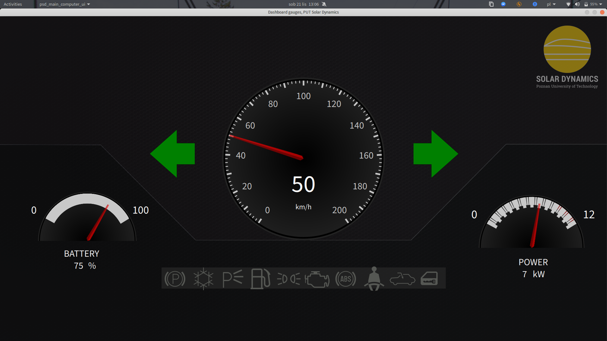

# Main computer software for PUT Solar Dynamics
Qt-based UI including dashboard gauges, information center. Data is read over virtual COM port named `PsdEcmComPort` according to data frame pattern `CAN-ID[DLC]DATA`. For more information visit `psd-ecm` repository.

Written for `upSquared` single-board computer with Ubuntu 20.04 linux.

